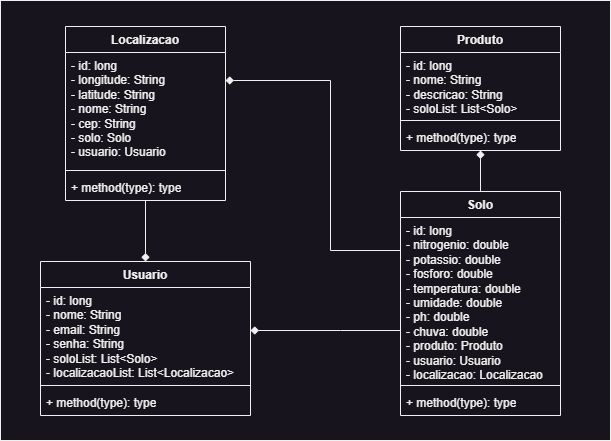

# DIGITAL BUSINESS ENABLEMENT

## Diagrama de Classes


## Endpoints
- Parceiro de Negócios
  - [Cadastrar Parceiro](#cadastrar-parceiro)

## PARCEIRO DE NEGÓCIOS

### Cadastrar Parceiro

`POST` /aishoppingbuddy/api/parceiro

*Campos de requisição*

| campo            | tipo   | obrigatório | descrição                         |
|------------------|--------|:-----------:|-----------------------------------|
| nomeFantasia     | String |     sim     | Nome Fantasia do parceiro         |
| dataEntrada      | Date   |     sim     | Data de Entrada do parceiro       |
| dataEncerramento | Date   |     não     | Data de Encerramento do parceiro  |
| cnpj             | String |     sim     | CPNJ do parceiro                  |

*Exemplo de requisição*
```
{
  "nomeFantasia": "MercadoLivre",
  "dataEntrada": "2023-06-04",
  "dataSaida": null,
  "cnpj": "19951232000153"
}
```

*Resposta*

| código | descrição                             |
|--------|---------------------------------------|
| 201    | o parceiro foi cadastrado com sucesso |
| 400    | dados inválidos                       |


